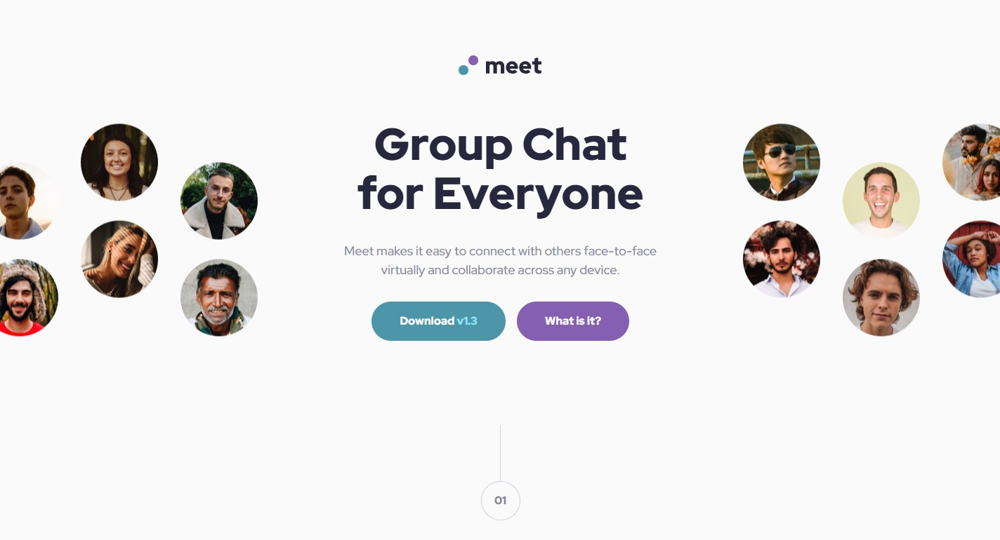

# Frontend Mentor - Solução da Landing Page do Meet (Meet Landing Page)

Esta é a minha solução para o desafio "Meet landing page" do Frontend Mentor. Os desafios do Frontend Mentor ajudam você a aprimorar suas habilidades de codificação construindo projetos realistas.

## Visão Geral

### O Desafio

Os usuários devem ser capazes de:
- Visualizar o layout ideal dependendo do tamanho da tela do dispositivo (responsividade completa).
- Ver estados de hover (passar o mouse) para elementos interativos.

### Captura de Tela



### Links

- **Código no GitHub:** [Visualizar Repositório](https://github.com/mnyellison/meet-landing-page)
- **Site Online (Live Preview):** [Acessar Projeto](https://meet-landing-page-sigma-blue.vercel.app/)

---

## Meu Processo

### Tecnologias Utilizadas

- HTML5 Semântico
- Variáveis CSS (Custom Properties)
- Flexbox
- CSS Grid (com colunas em formato de Grid Defensivo)
- Fluxo de desenvolvimento Mobile-first
- Arquitetura Limpa (estrutura CSS modular inspirada no padrão 7-1)
- Práticas de Acessibilidade (a11y) e UX avançadas

---

### O que eu aprendi neste projeto

Durante este projeto, avancei bastante minhas habilidades de front-end ao lidar com restrições de layout, bugs de especificidade de CSS e arquitetura de código. Estes foram os principais aprendizados:

1. **CSS Grid Defensivo:** Aprendi que colunas fracionárias padrão (`1fr`) possuem uma largura mínima implícita de `auto`. Em viewports muito estreitos, isso pode esmagar os elementos de texto centralizados. Resolvi isso aplicando limites explícitos com `minmax(0, 1fr)` nas colunas laterais do layout, protegendo a estrutura do conteúdo central.

2. **Sobrescrita de Especificidade CSS:** Enfrentei um cenário de depuração onde estilos de classe de componentes eram ignorados devido a seletores compostos mais fortes (`.parent img`) herdados de media queries do tablet. Corrigi isso utilizando caminhos de seletores exatos para aumentar a especificidade de forma limpa:

```css
.hero-images .img-desktop-left,
.hero-images .img-desktop-right {
  min-width: auto;
  max-width: 394px;
}
```

3. **Estrutura de Pastas Modular:** Fiz a transição de uma folha de estilo única e monolítica para uma estrutura modular de nível de produção, dividindo os arquivos de forma lógica em diretórios `base/`, `components/` e `layouts/` utilizando regras `@import` nativas do CSS.

### Próximos passos

Para os meus futuros projetos, pretendo focar em:

- Integração mais profunda das diretrizes de acessibilidade na web (WCAG).
- Aprimorar layouts responsivos avançados utilizando técnicas de tipografia fluida (`clamp()`).
- Automatizar fluxos de trabalho e otimização de CSS.

### Colaboração com IA (Gemini)

Colaborei com o Gemini como um parceiro de pair programming durante este projeto.

- **Como utilizei:** Usamos a IA para sessões complexas de depuração (inspecionando comportamentos do DevTools quando os limites de layout quebravam), discutindo técnicas ideais de alinhamento em desktop e mapeando a arquitetura de arquivos CSS modulares.
- **O que funcionou bem:** A IA foi extremamente eficaz para diagnosticar conflitos de especificidade de CSS e explicar a matemática por trás do esmagamento de componentes em viewports específicos. Também ajudou a traduzir padrões de design de software de alto nível para arquivos CSS modulares puros.

## Author

- Frontend Mentor - [@mnyellison](https://www.frontendmentor.io/profile/mnyellison)
- GitHub - [@mnyellison](https://github.com/mnyellison)
